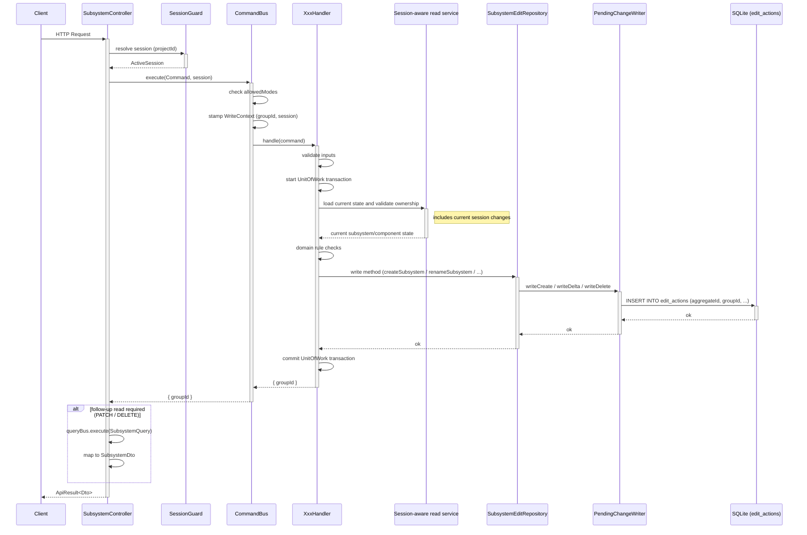

<!--
 Copyright (c) Qualcomm Technologies, Inc. and/or its subsidiaries.
 SPDX-License-Identifier: BSD-3-Clause
-->

# Subsystem Write API — LLD

**Date:** 2026-08-13
**Status:** Requirements aligned - pending review
**Requirements:** [`../requirements/subsystem-requirements.md`](../requirements/subsystem-requirements.md)
**Framework reference:** [`docs/edit-crud/overall-design.md`](../../edit-crud/overall-design.md)

---

## Table of Contents

1. [Overview](#1-overview)
2. [Aggregate Design](#2-aggregate-design)
3. [Write Flow](#3-write-flow)
4. [SubsystemRepository](#4-subsystemrepository)
5. [Commands and Handlers](#5-commands-and-handlers)
   - 5.1 [FR-SS-01 — Create Subsystem](#51-fr-ss-01--create-subsystem)
   - 5.2 [FR-SS-02 — Delete Subsystem](#52-fr-ss-02--delete-subsystem)
   - 5.3 [FR-SS-03/05/06 — Patch Subsystem](#53-fr-ss-030506--patch-subsystem)
   - 5.4 [FR-SS-04 — Set Filtered Keys](#54-fr-ss-04--set-filtered-keys)
   - 5.5 [FR-SS-07 — Move Components](#55-fr-ss-07--move-components)
6. [Controller and DTOs](#6-controller-and-dtos)
7. [CommandHandlerRegistry](#7-commandhandlerregistry)
8. [Error Handling](#8-error-handling)
9. [Folder Structure](#9-folder-structure)
10. [Open Items](#10-open-items)

---

## 1. Overview

This LLD specifies the write path for all subsystem management operations defined in the
requirements document. All operations follow the Hexagonal + CQRS + DDD pattern: the controller
translates HTTP into a command, the `CommandBus` starts a `UnitOfWork`, the handler executes
domain logic, and a new `SubsystemEditRepository` stages changes as `edit_actions` rows.

**APIs in scope:**

| FR | HTTP | Endpoint |
|----|------|----------|
| FR-SS-01 | `POST` | `/arc-api/v1/projects/{projectId}/subsystems` |
| FR-SS-02 | `DELETE` | `/arc-api/v1/projects/{projectId}/subsystems/{subsystemSystemId}` |
| FR-SS-03, FR-SS-05, FR-SS-06 | `PATCH` | `/arc-api/v1/projects/{projectId}/subsystems/{subsystemSystemId}` |
| FR-SS-04 | `PUT` | `/arc-api/v1/projects/{projectId}/subsystems/{subsystemSystemId}/filtered-keys` |
| FR-SS-07 | `POST` | `/arc-api/v1/projects/{projectId}/subsystems/components/move` |

FR-SS-03, FR-SS-05, and FR-SS-06 share the same `PATCH` endpoint and are handled by a single
`PatchSubsystemCommand`.

---

## 2. Aggregate Design

**Subsystem is its own aggregate root.** The `aggregateId` on every `edit_actions` row produced
by these handlers is the subsystem's `systemId`.

The domain entity `Subsystem` extends `Node`, which carries `systemId`, `fileSystemId`,
`parentId`, `dataPorts`, and `controlPorts`. Child entities written through the subsystem edit
repo (ports, filtered keys, parent relationships) carry the same `aggregateId = subsystemSystemId`.

This LLD brings Subsystem into edit scope by introducing `SubsystemEditRepository` — the
dedicated write interface for this aggregate. No other handler may produce `edit_actions` rows
attributed to the Subsystem aggregate.

---

## 3. Write Flow

The diagram below shows the general request lifecycle shared by all five write operations.
Operation-specific steps (validation reads, domain checks, ID generation) are handled inside
the handler box.



---

## 4. SubsystemRepository

### 4.1 Interface (core)

**File:** `packages/core/src/application/ports/persistence/repositories/subsystem/subsystem.repository.ts`

Extend the existing `SubsystemRepository` interface — do **not** create a separate file.

```typescript
import type {Subsystem} from '../../../../domain/entities/usecase-data/subsystem/subsystem.js';
import type {DataPort} from '../../../../domain/entities/usecase-data/node/entities/data-port.js';
import type {ControlPort} from '../../../../domain/entities/usecase-data/node/entities/control-port.js';
import type {EditOptions} from '../../edit-options.js';

export interface SubsystemEditRepository {
  // ── Write methods ─────────────────────────────────────────────────────────
  createSubsystem(subsystem: Subsystem, options?: EditOptions): Promise<void>;
  deleteSubsystem(systemId: number, options?: EditOptions): Promise<void>;
  renameSubsystem(systemId: number, name: string, options?: EditOptions): Promise<void>;
  setFilteredKeys(systemId: number, keySystemIds: number[], options?: EditOptions): Promise<void>;
  addDataPort(port: DataPort, subsystemSystemId: number, options?: EditOptions): Promise<void>;
  removeDataPort(portSystemId: number, subsystemSystemId: number, options?: EditOptions): Promise<void>;
  addControlPort(port: ControlPort, subsystemSystemId: number, options?: EditOptions): Promise<void>;
  removeControlPort(portSystemId: number, subsystemSystemId: number, options?: EditOptions): Promise<void>;
  updateParentId(
    subsystemSystemId: number,
    parentSubsystemSystemId: number | null,
    options?: EditOptions,
  ): Promise<void>;
}
```

The existing `ModuleRepository` gains the corresponding `updateParentId(moduleSystemId,
parentSubsystemSystemId, options?)` write method. A component move is an application operation,
not a `SubsystemRepository` bulk write: the core handler resolves the affected modules and calls
the repository for each one, while it calls `SubsystemRepository.updateParentId` for each selected
subsystem.

Command-handler method coverage:

| Command handler | Repository methods |
|-----------------|--------------------|
| `CreateSubsystemHandler` | `createSubsystem` |
| `DeleteSubsystemHandler` | `deleteSubsystem` |
| `PatchSubsystemHandler` | `renameSubsystem`, `addDataPort`, `removeDataPort`, `addControlPort`, `removeControlPort` |
| `SetSubsystemFilteredKeysHandler` | `setFilteredKeys` |
| `MoveSubsystemComponentsHandler` | `ModuleRepository.updateParentId`, `SubsystemRepository.updateParentId`, link repositories |

### 4.2 Adapter (persistence)

**File:** `packages/infrastructure/persistence/src/persistence-typeorm-sqllite/repositories/subsystem/subsystem.repository.ts`

Extend the existing TypeORM subsystem repository with the write methods — do **not** create a separate adapter file.
`updateParentId` writes the `nodes.parent_id` delta for a subsystem node. The TypeORM module
repository implements the matching module-node delta method.

`aggregateId` is always the subsystem's `systemId` — including for child `DataPort` and
`ControlPort` rows.

Handlers obtain current subsystem, component, ownership, and name-uniqueness state through
existing session-aware read services. Those validation reads include the current session's
pending `edit_actions` but are intentionally not part of `SubsystemEditRepository`.

### 4.3 TypeOrmUnitOfWork wiring

No new wiring required. The existing `uow.getSubsystemRepository()` already returns the
`TypeOrmSubsystemRepository`. Since write methods are added to the same class, all handlers
call `uow.getSubsystemRepository()` directly — no new accessor needed.

---

## 5. Commands and Handlers

### 5.1 FR-SS-01 — Create Subsystem

**Files:**
```
packages/core/src/application/usecase-designer/subsystem/create/
  create-subsystem.command.ts
  create-subsystem.handler.ts
```

#### Command

```typescript
export class CreateSubsystemCommand extends BaseCommand {
  static override readonly requiresSession = true;
  static override readonly allowedModes: readonly SessionMode[] = [
    SESSION_MODE.Designer,
    SESSION_MODE.DiffMerge,
  ];

  constructor(
    clientId: string,
    public readonly fileSystemId: number,
    public readonly name: string | undefined,
    public readonly parentId: number | undefined,
  ) {
    super(clientId);
  }
}
```

#### Handler logic

```
1. If name provided and name.length > 255 → throw InvalidOperationException
2. await uow.startTransaction()
3. const subsystemSystemId = await idGeneration.getNextId(fileSystemId)
4. const subsystemId = naturalIdGeneration.getNextId(fileSystemId, NaturalIdType.SUBSYSTEM)
5. const resolvedName = name ?? `SS_0x${subsystemId.toString(16).padStart(8, '0').toUpperCase()`
6. If name provided:
     validate global case-insensitive uniqueness through the session-aware read service
     → throw DomainRuleViolationException if taken (I1)
7. If parentId provided:
     validate that the parent subsystem exists in this project through the session-aware read service
     → throw ResourceNotFoundException if absent
8. Construct Subsystem entity: empty dataPorts, controlPorts, filteredKeySystemIds = []
9. await repo.createSubsystem(subsystem)
10. await uow.commit()
11. return { groupId, subsystemSystemId, subsystemId, name: resolvedName, parentId }
```

The name validation includes pending creates in the current session, preventing a duplicate
name from being staged before commit.

#### Controller response

No follow-up read needed. The handler returns the lean response directly:

```typescript
return toApiResult(Result.ok(result), r =>
  new CreateSubsystemResponseDto(r.subsystemSystemId, r.subsystemId, r.name, r.parentId),
);
```

---

### 5.2 FR-SS-02 — Delete Subsystem

**Files:**
```
packages/core/src/application/usecase-designer/subsystem/delete/
  delete-subsystem.command.ts
  delete-subsystem.handler.ts
```

#### Command

```typescript
export class DeleteSubsystemCommand extends BaseCommand {
  static override readonly requiresSession = true;
  static override readonly allowedModes: readonly SessionMode[] = [
    SESSION_MODE.Designer,
    SESSION_MODE.DiffMerge,
  ];

  constructor(
    clientId: string,
    public readonly subsystemSystemId: number,
    public readonly fileSystemId: number,
  ) {
    super(clientId);
  }
}
```

#### Handler logic

```
1. await uow.startTransaction()
2. Load the current subsystem state through the session-aware read service
3. If absent → throw ResourceNotFoundException
4. If (subsystem.children.subsystemSystemIds?.length ?? 0) + (subsystem.children.subgraphSystemIds?.length ?? 0) > 0:
     throw DomainRuleViolationException([
       IssueFactory.subsystemNotEmpty(subsystemSystemId)
     ])
     // message: "Subsystem is not empty — remove all children before deleting."
5. await repo.deleteSubsystem(subsystemSystemId)
6. await uow.commit()
7. return { groupId, deletedSubsystemSnapshot }
```

The handler returns the pre-deletion snapshot directly. This satisfies the delete response
contract without querying a subsystem after it has been removed.

---

### 5.3 FR-SS-03/05/06 — Patch Subsystem

FR-SS-03 (rename), FR-SS-05 (data port count), and FR-SS-06 (control port count) all map to
`PATCH /projects/{projectId}/subsystems/{subsystemSystemId}`. They are consolidated into one
`PatchSubsystemCommand`.

**Files:**
```
packages/core/src/application/usecase-designer/subsystem/patch/
  patch-subsystem.command.ts
  patch-subsystem.handler.ts
```

#### Command

```typescript
export class PatchSubsystemCommand extends BaseCommand {
  static override readonly requiresSession = true;
  static override readonly allowedModes: readonly SessionMode[] = [
    SESSION_MODE.Designer,
    SESSION_MODE.DiffMerge,
  ];

  constructor(
    clientId: string,
    public readonly subsystemSystemId: number,
    public readonly fileSystemId: number,
    public readonly name: string | undefined,
    public readonly inputDataPortCount: number | undefined,
    public readonly outputDataPortCount: number | undefined,
    public readonly controlPortCount: number | undefined,
  ) {
    super(clientId);
  }
}
```

#### Handler logic

```
1. If name, inputDataPortCount, outputDataPortCount, controlPortCount are all undefined:
     throw InvalidOperationException('At least one field must be provided.')
2. await uow.startTransaction()
3. Load the current subsystem state through the session-aware read service
4. If absent → throw ResourceNotFoundException

Rename (if name is defined):
5a. If name.trim() === '': do not stage a rename; retain subsystem.name
5b. Otherwise, if name.length > 255 → throw InvalidOperationException
5c. Otherwise validate global case-insensitive uniqueness through the session-aware read service
    If taken → throw DomainRuleViolationException (duplicate name, I1)
5d. Otherwise await repo.renameSubsystem(subsystemSystemId, name)

Data port count (inputDataPortCount and/or outputDataPortCount defined):
6. allocatedDataPortIds = Set of all subsystem.dataPorts[*].dataPortId
   applyDataPortCountChange(PORT_IO_TYPE.Input, inputDataPortCount, allocatedDataPortIds)
   applyDataPortCountChange(PORT_IO_TYPE.Output, outputDataPortCount, allocatedDataPortIds)
   (each direction is independent — partial success is allowed per FR-SS-05)

Control port count (controlPortCount defined):
7. applyControlPortCountChange(controlPortCount)

8. await uow.commit()
9. return { groupId }
```

**Partial-success transaction rule:** Subsystem existence and rename validation are request-level
checks; failure rolls back the whole request. For each requested input, output, or control port
count, the handler first evaluates occupancy independently. It records an occupied-port failure
as an issue and stages no writes for that direction, while staging every direction that passes.
If no requested operation succeeds, the handler rolls back and throws the first port violation.
Otherwise it commits the staged changes and returns `Result.partial({groupId}, issues)` when any
direction failed, or `Result.ok({groupId})` when all requested changes succeeded.
`PartialSuccessInterceptor` converts a result containing an ERROR or FATAL issue to HTTP 207.

#### Port count change algorithm

**`applyDataPortCountChange(direction, requested, allocatedDataPortIds)`:**

```
current = subsystem.dataPorts filtered by direction
if requested === undefined: return (no-op)
if requested === current.length: return (no-op)

if requested > current.length:
  portIds = nextDataPortIds(
    allocatedDataPortIds,
    direction === PORT_IO_TYPE.Input,
    MODULE_PORT_STRATEGIES.SEQUENTIAL,
    requested - current.length,
  )
  for portId in portIds:
    portSystemId = await idGeneration.getNextId(fileSystemId)
    await repo.addDataPort(
      new DataPort({ systemId: portSystemId, dataPortId: portId, portIoType: direction, isStatic: false, name: '' }),
      subsystemSystemId,
    )
    allocatedDataPortIds.add(portId)

if requested < current.length:
  links = await dataLinkRepo.getLinksByPortSystemIds(current.map(p => p.systemId), fileSystemId)
  outcome = resolvePortCountChange(
    current,
    requested,
    Number.MAX_SAFE_INTEGER,
    links,
    ISSUE_ENTITY_TYPE.DataPort,
    subsystemSystemId,
  )
  if outcome is fail: return its issues // caller records a per-direction issue
  for each portSystemId in outcome.data.toRemove:
    await repo.removeDataPort(portSystemId, subsystemSystemId)
```

The handler reuses `nextDataPortIds` and `resolvePortCountChange` from the module PATCH flow
instead of duplicating port allocation and occupied-port detection. Passing the sequential module
strategy with one shared allocation set across both directions preserves the subsystem's shared,
gap-filling ID space even when one PATCH increases both counts. `resolvePortCountChange` also
supplies the link-aware failure issues and the port IDs to remove.

**`applyControlPortCountChange(requested)`** likewise reuses `resolvePortCountChange` with
`controlPorts` and `controlLinkRepo.getLinksByPortSystemIds`; it uses `nextControlPortIds` for
new control-port IDs.

The controller performs a follow-up read after a committed complete or partial result and
returns the updated `SubsystemDto` together with any issues.

---

### 5.4 FR-SS-04 — Set Filtered Keys

**Files:**
```
packages/core/src/application/usecase-designer/subsystem/set-filtered-keys/
  set-subsystem-filtered-keys.command.ts
  set-subsystem-filtered-keys.handler.ts
```

#### Command

```typescript
export class SetSubsystemFilteredKeysCommand extends BaseCommand {
  static override readonly requiresSession = true;
  static override readonly allowedModes: readonly SessionMode[] = [
    SESSION_MODE.Designer,
    SESSION_MODE.DiffMerge,
  ];

  constructor(
    clientId: string,
    public readonly subsystemSystemId: number,
    public readonly fileSystemId: number,
    public readonly keySystemIds: number[],
  ) {
    super(clientId);
  }
}
```

#### Handler logic

```
1. await uow.startTransaction()
2. Load the current subsystem state through the session-aware read service
3. If absent → throw ResourceNotFoundException
4. For each id in command.keySystemIds:
     verify key-definition exists via PropertyDefinitionsRepository or KeyDefinitionRepository
     If not found → throw ResourceNotFoundException(`KeyDefinition ${id} not found`)
5. await repo.setFilteredKeys(subsystemSystemId, keySystemIds)
6. await uow.commit()
7. return { groupId }
```

The controller returns a lean `FilteredKeyDto[]` directly — no follow-up subsystem read required.
The handler returns the resolved key list (each entry: `keySystemId`, `keyId`, `keyLabel`)
fetched during step 4's validation, avoiding a separate query after commit.

---

### 5.5 FR-SS-07 — Move Components

**Files:**
```
packages/core/src/application/usecase-designer/subsystem/move/
  move-subsystem-components.command.ts
  move-subsystem-components.handler.ts
```

#### Command

```typescript
export class MoveSubsystemComponentsCommand extends BaseCommand {
  static override readonly requiresSession = true;
  static override readonly allowedModes: readonly SessionMode[] = [
    SESSION_MODE.Designer,
    SESSION_MODE.DiffMerge,
  ];

  constructor(
    clientId: string,
    public readonly fileSystemId: number,
    public readonly subgraphSystemIds: number[],
    public readonly subsystemSystemIds: number[],
    public readonly targetSubsystemSystemId: number | null,
  ) {
    super(clientId);
  }
}
```

#### Handler logic

```
1. If subgraphSystemIds.length === 0 && subsystemSystemIds.length === 0
     → throw InvalidOperationException('At least one component system ID must be provided.')
2. await uow.startTransaction()
3. Validate every supplied subgraph and subsystem exists in this project.
   A missing component returns 404; an out-of-project component returns 422. No move is staged.
4. If targetSubsystemSystemId !== null:
     Validate target subsystem exists in this project → ResourceNotFoundException if absent

For each id in subsystemSystemIds:
5a. id === targetSubsystemSystemId → DomainRuleViolationException (circular, I2)
5b. id is a descendant of target → DomainRuleViolationException (circular, I2)
5c. id already a direct child of target location → DomainRuleViolationException (duplicate child, I2)

For each id in subgraphSystemIds:
6a. id already a direct child of target location → DomainRuleViolationException (duplicate child, I2)

After all validations pass:
7. Resolve each supplied subgraph to its member modules through the session-aware topology reader.
   For each module, call `moduleRepo.updateParentId(moduleSystemId, targetSubsystemSystemId)`.
8. For each selected subsystem, recursively load its descendant topology for link reconstruction,
   then call `subsystemRepo.updateParentId(subsystemSystemId, targetSubsystemSystemId)`.
   Descendants retain their direct parent IDs, so moving a subsystem preserves its internal tree.

The handler owns this traversal and the calls to both repositories in `packages/core`; adapters
only stage their respective `nodes.parent_id` deltas. Every re-parenting write uses the current
write context and the same transaction/group ID.

Link reconstruction (after all re-parenting):
9. Identify every affected data and control subsystem-link segment in both the committed state
   and the active edit-session overlay.
10. For resolved segments (a non-null data/control-link ID), follow FR-VL-20a: directly stage
    deletion of the old segments, retain the physical DataLink or ControlLink, and create the
    complete replacement chain for the new hierarchy.
11. For unresolved overlay-only segments (a null data/control-link ID), stage deletion when the
    move affects either endpoint or boundary. They have no physical link to retain and cannot be
    safely re-parented as a partial chain.
12. Any subsystems whose port wiring changed are tracked in subsystemPortChanges.

13. await uow.commit()
14. return { groupId, updatedModules, updatedSubsystems,
              addedDataLinks, removedDataLinks,
              addedControlLinks, removedControlLinks,
              subsystemPortChanges }
```

The controller maps the handler result directly to `MoveSubsystemComponentsResponseDto` — no
separate follow-up read needed since the handler builds all collections during execution.

---

## 6. Controller and DTOs

### 6.1 DTO correction — `CreateSubsystemRequestDto`

**File:** `packages/api/src/presentation/rest/modules/subsystem/dto/request/create-subsystem-request.dto.ts`

Current `name` is marked `@IsNotEmpty()` (required). Per FR-SS-01 it is optional.

```typescript
export class CreateSubsystemRequestDto {
  @ApiProperty({
    required: false,
    description: 'Subsystem name — max 255 chars. Omit to auto-generate SS_0x{id:X8}.',
    maxLength: 255,
  })
  @IsOptional()
  @IsString()
  @MaxLength(255)
  name?: string;

  @ApiProperty({
    required: false,
    description: 'System ID of parent subsystem. Omit for root level.',
  })
  @IsOptional()
  @IsInt()
  @IsPositive()
  parentId?: number;
}
```

### 6.2 New response DTO — `CreateSubsystemResponseDto`

**File:** `packages/api/src/presentation/rest/modules/subsystem/dto/response/create-subsystem-response.dto.ts`

```typescript
export class CreateSubsystemResponseDto {
  @ApiProperty({ description: 'System-generated unique identifier' })
  systemId!: number;

  @ApiProperty({ description: 'Sequential natural subsystem ID' })
  naturalId!: number;

  @ApiProperty({ description: 'Assigned or auto-generated name' })
  name!: string;

  @ApiProperty({ required: false, description: 'Parent subsystem system ID, if nested' })
  parentId?: number;
}
```

### 6.3 `PatchSubsystemRequestDto` — add port count fields

**File:** `packages/api/src/presentation/rest/modules/subsystem/dto/request/patch-subsystem-request.dto.ts`

```typescript
export class PatchSubsystemRequestDto {
  @ApiProperty({ required: false, maxLength: 255 })
  @IsOptional()
  @IsString()
  @MaxLength(255)
  name?: string;

  @ApiProperty({ required: false, minimum: 0 })
  @IsOptional()
  @IsInt()
  @Min(0)
  inputDataPortCount?: number;

  @ApiProperty({ required: false, minimum: 0 })
  @IsOptional()
  @IsInt()
  @Min(0)
  outputDataPortCount?: number;

  @ApiProperty({ required: false, minimum: 0 })
  @IsOptional()
  @IsInt()
  @Min(0)
  controlPortCount?: number;
}
```

### 6.4 `SetSubsystemFilteredKeysRequestDto`

**File:** `packages/api/src/presentation/rest/modules/subsystem/dto/request/set-subsystem-filtered-keys-request.dto.ts`

`keySystemIds` is required and must be an array. An empty array is valid and clears all filtered
keys; `null` or an omitted property is rejected as a 400 request error.

```typescript
export class SetSubsystemFilteredKeysRequestDto {
  @ApiProperty({ type: [String] })
  @IsArray()
  @IsString({ each: true })
  keySystemIds!: string[];
}
```

The handler resolves the provided keys and returns the required `FilteredKeyDto[]` list
(`keySystemId`, `keyId`, `keyLabel`) directly; it does not perform a follow-up subsystem read.

### 6.5 `MoveSubsystemComponentsRequestDto`

**File:** `packages/api/src/presentation/rest/modules/subsystem/dto/request/move-subsystem-components-request.dto.ts`

Flat structure — no nested `components` wrapper. `targetSubsystemSystemId: null` moves
components to root (subsumes the old "move-out" case).

```typescript
export class MoveSubsystemComponentsRequestDto {
  @ApiProperty({ type: [String], required: false })
  @IsOptional()
  @IsArray()
  @IsString({ each: true })
  subgraphSystemIds?: string[];

  @ApiProperty({ type: [String], required: false })
  @IsOptional()
  @IsArray()
  @IsString({ each: true })
  subsystemSystemIds?: string[];

  @ApiProperty({ type: 'string', nullable: true })
  @IsOptional()
  @IsString()
  targetSubsystemSystemId!: string | null;
}
```

### 6.6 Controller updates

The controller currently has an empty constructor with no bus injection. All five write methods
must be wired up. Pattern per method:

```typescript
@Post()
@UseGuards(SessionGuard)
@ApiOperation({ summary: 'Create an empty subsystem' })
@ApiBody({ type: CreateSubsystemRequestDto })
@ApiResponse({ status: 200, type: CreateSubsystemResponseDto })
@ApiResponse({ status: 400, description: 'Invalid input' })
@ApiResponse({ status: 403, description: 'No active session' })
@ApiResponse({ status: 404, description: 'Parent subsystem not found' })
@ApiResponse({ status: 422, description: 'Name already in use' })
async createSubsystem(
  @Param('projectId', ParseIntPipe) projectId: number,
  @Body() dto: CreateSubsystemRequestDto,
  @ArcSession() session: ActiveSession,
): Promise<ApiResult<CreateSubsystemResponseDto>> {
  const result = await this.commandBus.execute<CreateSubsystemResult>(
    new CreateSubsystemCommand('api-client', session.fileSystemId, dto.name, dto.parentId),
    session,
  );
  return toApiResult(Result.ok(result), r =>
    new CreateSubsystemResponseDto(r.subsystemSystemId, r.subsystemId, r.name, r.parentId),
  );
}
```

Constructor must be updated to inject both buses:

```typescript
constructor(
  private readonly commandBus: CommandBus,
  private readonly queryBus: QueryBus,
) {
  super();
}
```

Move components uses the existing REST endpoint in
`packages/api/src/presentation/rest/modules/subsystem/subsystem.controller.ts`:

```typescript
@Post('components/move')
async moveComponents(
  @Param('projectId') projectId: string,
  @Body() request: MoveSubsystemComponentsRequestDto,
  @ArcSession() session: ActiveSession,
): Promise<ApiResult<MoveSubsystemComponentsResponseDto>> {
  const hasSubgraphs = (request.subgraphSystemIds?.length ?? 0) > 0;
  const hasSubsystems = (request.subsystemSystemIds?.length ?? 0) > 0;
  if (!hasSubgraphs && !hasSubsystems) {
    throw new BadRequestException(
      'At least one of subgraphSystemIds or subsystemSystemIds must be provided',
    );
  }

  const result = await this.commandBus.execute<MoveSubsystemComponentsResult>(
    new MoveSubsystemComponentsCommand(
      'api-client',
      session.fileSystemId,
      parseSystemIds(request.subgraphSystemIds ?? []),
      parseSystemIds(request.subsystemSystemIds ?? []),
      parseOptionalSystemId(request.targetSubsystemSystemId),
    ),
    session,
  );

  return toApiResult(Result.ok(result), r => r);
}
```

`parseSystemIds` and `parseOptionalSystemId` reject malformed, non-integer, negative, or
out-of-range unsigned IDs with `BadRequestException`. They are the only HTTP-to-command
conversion point: request and response DTOs retain string IDs, while commands and repositories
use numeric IDs.

The HTTP client provides component IDs and the target subsystem/root only. The core handler
resolves subgraphs to their module nodes, calls `ModuleRepository.updateParentId` for those
modules, and calls `SubsystemRepository.updateParentId` for selected subsystem nodes inside the
current session transaction.

`MoveSubsystemComponentsRequestDto` does not expose persistence-layer aggregate details.

---

## 7. CommandHandlerRegistry

**File:** `packages/core/src/application/orchestration/cqrs/registries/command-handler-registry.ts`

```typescript
this.commandHandlerFactories.set(CreateSubsystemCommand, {
  create: deps =>
    new CreateSubsystemHandler(deps.uow, deps.idGeneration, deps.naturalIdGeneration),
});
this.commandHandlerFactories.set(DeleteSubsystemCommand, {
  create: deps => new DeleteSubsystemHandler(deps.uow),
});
this.commandHandlerFactories.set(PatchSubsystemCommand, {
  create: deps => new PatchSubsystemHandler(deps.uow, deps.idGeneration),
});
this.commandHandlerFactories.set(SetSubsystemFilteredKeysCommand, {
  create: deps => new SetSubsystemFilteredKeysHandler(deps.uow),
});
this.commandHandlerFactories.set(MoveSubsystemComponentsCommand, {
  create: deps => new MoveSubsystemComponentsHandler(deps.uow),
});
```

All five command classes must also be exported from `packages/core/src/index.ts`.

---

## 8. Error Handling

| Condition | Exception | HTTP |
|-----------|-----------|------|
| Subsystem not found | `ResourceNotFoundException` | 404 |
| Parent subsystem not found | `ResourceNotFoundException` | 404 |
| KeyDefinition not found | `ResourceNotFoundException` | 404 |
| Component not found | `ResourceNotFoundException` | 404 |
| No fields provided (PATCH) | `InvalidOperationException` | 400 |
| Malformed or out-of-range system ID | `InvalidOperationException` | 400 |
| Name exceeds 255 characters | `InvalidOperationException` | 400 |
| Both `subgraphSystemIds` and `subsystemSystemIds` are empty | `InvalidOperationException` | 400 |
| Component does not belong to this project | `DomainRuleViolationException` | 422 |
| Duplicate subsystem name (I1) | `DomainRuleViolationException` | 422 |
| Delete with children present | `DomainRuleViolationException` | 422 |
| Occupied port cannot be removed (I3) | `DomainRuleViolationException` | 422 |
| Circular subsystem hierarchy (I2) | `DomainRuleViolationException` | 422 |
| Component already a child (I2) | `DomainRuleViolationException` | 422 |

New `IssueFactory` entries required:
- `subsystemNotEmpty(subsystemSystemId)` — message: "Subsystem is not empty — remove all children before deleting."
- `duplicateSubsystemName(name)` — message: name conflict
- `occupiedSubsystemPortCannotBeRemoved(portSystemId)` — I3
- `circularSubsystemHierarchy(componentSystemId, targetSystemId)` — I2
- `duplicateChildComponent(componentSystemId, subsystemSystemId)` — I2

---

## 9. Folder Structure

### New files

```
packages/core/src/application/
  usecase-designer/subsystem/
    create/
      create-subsystem.command.ts
      create-subsystem.handler.ts
    delete/
      delete-subsystem.command.ts
      delete-subsystem.handler.ts
    patch/
      patch-subsystem.command.ts
      patch-subsystem.handler.ts
    set-filtered-keys/
      set-subsystem-filtered-keys.command.ts
      set-subsystem-filtered-keys.handler.ts
    move/
      move-subsystem-components.command.ts
      move-subsystem-components.handler.ts

packages/api/src/presentation/rest/modules/subsystem/
  dto/response/
    create-subsystem-response.dto.ts          ← new
  dto/request/
    move-subsystem-components-request.dto.ts  ← flat request (subgraphSystemIds, subsystemSystemIds, targetSubsystemSystemId)
```

### Modified files

```
packages/core/src/application/ports/persistence/repositories/subsystem/
  subsystem.repository.ts                     ← add write contracts, including updateParentId

packages/core/src/application/ports/persistence/repositories/module/
  module.repository.ts                        ← add updateParentId for moved subgraph modules

packages/infrastructure/persistence/src/persistence-typeorm-sqllite/repositories/subsystem/
  subsystem.repository.ts                     ← add write method implementations, including updateParentId

packages/infrastructure/persistence/src/persistence-typeorm-sqllite/repositories/module/
  module.repository.ts                        ← add updateParentId implementation

packages/core/src/application/orchestration/cqrs/registries/
  command-handler-registry.ts                 ← register 5 new handlers

packages/core/src/index.ts                    ← export 5 new command classes

packages/api/src/presentation/rest/modules/subsystem/
  subsystem.controller.ts                     ← inject buses, implement 5 write methods
  dto/request/
    create-subsystem-request.dto.ts           ← fix name to @IsOptional()
    patch-subsystem-request.dto.ts            ← add inputDataPortCount, outputDataPortCount,
                                                 controlPortCount fields
  dto/response/
    update-subsystem-filtered-keys-response.dto.ts
                                                 ← return the required FilteredKeyDto[] response
```

---

## 10. Open Items

| ID | Item | Blocks |
|----|------|--------|
| OI-1 | **Data port ID space** — requirements specify "minimum available ID" without clarifying whether input and output ports share one ID space. This LLD assumes a **shared** space (one pool per subsystem, across both directions). Confirm before implementing. | FR-SS-05 |
| OI-2 | **New `IssueFactory` entries** — `subsystemNotEmpty`, `duplicateSubsystemName`, `occupiedSubsystemPortCannotBeRemoved`, `circularSubsystemHierarchy`, `duplicateChildComponent` must be added to `packages/core/src/shared/issues/factories.ts`. | All DomainRuleViolationException sites |
| OI-3 | **Follow-up read shape for PATCH** — verify the existing subsystem query service returns `SubsystemDto` with ports and filtered keys populated after both complete and partial updates. Delete returns its pre-deletion snapshot directly. | FR-SS-03, FR-SS-05, FR-SS-06 |
